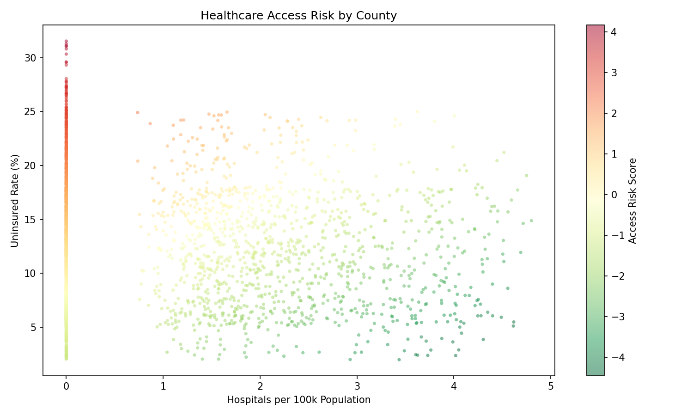

## Healthcare Access Risk Analysis

### Problem
Healthcare access is uneven across US counties. This project identifies where additional resources should be allocated to improve access most effectively.

### Approach
- Generated a synthetic dataset covering **3,200+ US counties** with population, uninsured rates, and hospital counts
- Standardized metrics using z-scores to compare counties on equal footing
- Built a **composite risk score** (high uninsured rate + low hospital density = high risk)
- Ranked counties by priority using a weighted model that factors in population demand
- Classified counties into risk tiers: Low, Moderate, High, Critical

### Interactive Map
The main output is an **interactive choropleth map** — counties colored by access risk score with hover tooltips showing:
- Risk tier
- Uninsured rate
- Hospitals per 100k population
- Population
- Priority rank



### How to Run

```bash
pip install -r requirements.txt

# Generate county-level dataset (3,200+ counties)
python src/generate_data.py

# Run analysis and scoring
python src/analysis.py

# Build interactive map
python src/build_map.py

# Open the map
open outputs/map.html
```

### Key Findings
- ~15% of counties fall into the **Critical** risk tier — concentrated in TX, FL, GA, MS, and rural areas
- Small rural counties show disproportionately low hospital access relative to their uninsured populations
- Resource allocation decisions significantly impact access outcomes depending on distribution strategy

### Outputs
| File | Description |
|------|-------------|
| `outputs/map.html` | Interactive choropleth map (open in browser) |
| `outputs/top_risk_counties.csv` | All counties ranked by access risk score |
| `outputs/priority_ranking.csv` | Counties ranked by priority score (risk + population weight) |
| `outputs/scatterplot.png` | Hospital density vs. uninsured rate visualization |

### Tools Used
- Python (pandas, matplotlib, folium)
- US Census county boundary GeoJSON
- Data analysis, scoring models, and geospatial visualization
